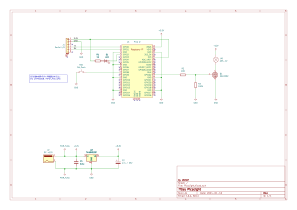

# PicoLight

日本語のREADMEは[こちら](./README_ja.md)

**PicoLight** is a 'Rotating Beacon Light' device controlled by Raspberry Pi Pico W. I created it as per my daughter's request :-).

## Specifications

- Controller
  - Raspberry Pi Pico W. Power supply is 3.3V.
- Rotating Beacon Light
  - Connected to GPIO22 (output).
  - Controlled by N-ch MOS FET.
- Push button switch
  - Connected to GPIO8 (input).
  - Set GPIO pin configuration to pull-up (INPUT_PULLUP).
- LED
  - Connected to GPIO2 (output).
  - Current limiting resistor is adjusted according to brightness.

## Schematic diagram

PDF is [here](./KiCad/PicoLight.pdf)

- D1 (LED) : Active Low
- LA1 (Rotating Beacon Light) : Active High
- SW1 (Push button switch) : Active Low

## MOS FET　selection

### Rated Specifications of Rotating Beacon

- ASS-12 Product Specifications
  - [Schneider Electric Japan Holdings Ltd.](https://www.proface.com/ja/product/signaling/beacon/ass)
  - [Akizuki Denshi Tsusho](https://akizukidenshi.com/goodsaffix/ass-12.pdf)
- Rated Voltage: 12V
- Power Consumption: 5W
- Surge Current: 4A
- Hence, the steady-state driving current is assumed to be $I_D=0.42A$.

### Required MOS FET Performance
- For driving the rotating beacon, the maximum ratings should meet the following criteria:
  - Drain-to-Source Voltage: $V_{DSS} > 12V$
  - Drain Current: $DC > 4A$
- The MOS FET's gate threshold voltage should be: $V_{th} < 2.5V$.
  - The H-level voltage of CMOS output: $Supply Voltage - 0.8V$
  - Since the GPIO supply voltage of Raspberry Pi Pico W is $3.3V$, the CMOS GPIO's H-level voltage is $3.3-0.8=2.5V(min)$.

### 2SK2232

- [Data sheet](https://toshiba.semicon-storage.com/info/2SK2232_datasheet_ja_20090929.pdf?did=13451&prodName=2SK2232)

- Maximum rating: $V_{DSS} = 60V$ ($> 12V$, no problem)
- Maximum rating: $DC = 25A$ ($> 4A$, no problem)
Gate threshold voltage: $V_{th} = 2.0V (max)$ ($< 2.5V$, no problem)
- Allowable power loss: $P_D = 35W$
  - Drain-to-Source On-Resistance $R_{DS(ON)} = 0.08\Omega (max)$
  - $P_D = {I_D}^2 \times R_{DS(ON)} = 0.42^2 \times 0.08 = 0.01W$ ($< 35W$, no problem)
- Since the switching speed with GPIO is slow, the input capacitance (1000pF) would be okay.

## Power Supply

- The output voltage of the AC adapter is 12V. Choose an AC adapter with sufficient current capacity since the surge current of ASS-12 is 4A.  
  e.g.: [Akizuki Denshi Tsusho's 12V 4.17A Switching AC Adapter](https://akizukidenshi.com/download/ds/litone/lte50es.pdf)
- The power supply 3.3V for Raspberry Pi Pico W is generated from a three-terminal regulator (TA48M033F).
