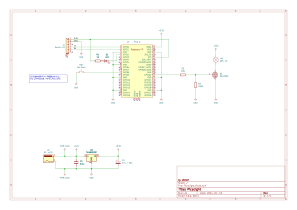

# PicoLight

娘に頼まれて、Raspberry Pi Pico Wで制御するパトライトを製作しました。

## 仕様

- コントローラー
  - RaspberryPi pico W を使用する。電源は3.3V。
- パトライト(回転灯)
  - GPIO22に接続(出力)。
  - N-ch MOS FETによりON/OFF制御する。
- 押ボタンSW
  - GPIO8に接続(入力)。
  - GPIOのピン設定をプルアップ(INPUT_PULLUP)にする。
- LED
  - GPIO2に接続(出力)。
  - 電流制限抵抗は明るさとの兼ね合いで現物合わせ。

## 回路図

PDFは[こちら](./KiCad/PicoLight.pdf)

- D1 (LED) : 負論理
- LA1 (回転灯) : 正論理
- SW1 (ボタンスイッチ) : 負論理

## MOS FETの選定

### 回転灯の定格

- ASS-12 製品仕様
  - [シュナイダーエレクトリックホールディングス株式会社](https://www.proface.com/ja/product/signaling/beacon/ass)
  - [秋月電子通商](https://akizukidenshi.com/goodsaffix/ass-12.pdf)
- 定格電圧: 12V
- 消費電力: 5W
- 突入電流: 4A
- 以上より、定常駆動電流: $I_D=0.42A$ とする。

### 必要なMOS FETの性能

- 回転灯駆動のため、最大定格が以下を満たすこと
  - ドレイン-ソース間電圧: $V_{DSS} > 12V$
  - ドレイン電流: $DC > 4A$
- MOS FETのゲート閾値電圧: $V_{th} < 2.5V$ であること。
  - CMOS出力のHレベル電圧: $電源電圧 - 0.8V$
  - Raspberry Pi pico WのGPIOの電源電圧は $3.3V$ なので、CMOSのGPIOのHレベル電圧は $3.3-0.8=2.5V(min)$ となることより。

### 2SK2232

- [データシート](https://toshiba.semicon-storage.com/info/2SK2232_datasheet_ja_20090929.pdf?did=13451&prodName=2SK2232)
- 最大定格: $V_{DSS}  = 60V$ ($> 12V$ なので問題なし)
- 最大定格: $DC = 25A$ ($> 4A$ なので問題なし)
- ゲート閾値電圧: $V_{th} = 2.0V(max)$ ($< 2.5V$ なので問題なし)
- 許容損失: $P_D = 35W$
  - ドレイン-ソース間オン抵抗 $R_{DS(ON)} = 0.08\Omega (max)$
  - $P_D = {I_D}^2 \times R_{DS(ON)} = 0.42^2 \times 0.08 = 0.01W$ ($< 35W$ なので問題なし。)
- GPIOでのスイッチング速度は遅いので、入力容量(1000pF)は気にしない。

## 電源

- ACアダプタの出力電圧は12V。回転灯の突入電流が4Aあるので十分な電流容量のACアダプタを選択すること。  
  参考: [秋月電子通商の12V 4.17AのスイッチングＡＣアダプター](https://akizukidenshi.com/download/ds/litone/lte50es.pdf)
- Raspberry Pi Pico Wの電源3.3Vは三端子レギュレータ（TA48M033F）から生成する。
